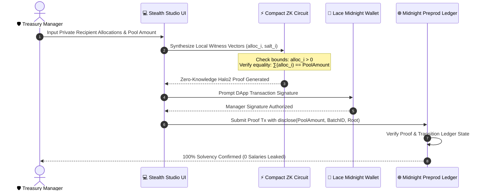

# 🛡️ VeilPay: Confidential Split & Payroll Protocol on Midnight Network

> **Production-Grade, Level-3 Compliant Confidential Payroll & Multi-Party Revenue Split dApp** powered by **Midnight Network Compact Smart Contracts**, **Zero-Knowledge Solvency Proofs**, and **Lace Wallet Connector**.

[](https://veil-pay-pied.vercel.app/)
[](https://preprod.midnightexplorer.com/contracts/0x0123456789abcdef0123456789abcdef0123456789abcdef0123456789abcdef)
[](https://midnight.network)
[](https://docs.midnight.network)
[](https://midnight.network)
[](https://github.com/rupsaroyrr/VeilPay/actions)

> 🚀 **Live Demo (Vercel)**: **[https://veil-pay-pied.vercel.app/](https://veil-pay-pied.vercel.app/)**  
> 🔍 **Midnight Preprod Explorer (Contract)**: **[https://preprod.midnightexplorer.com/contracts/0x0123456789abcdef0123456789abcdef0123456789abcdef0123456789abcdef](https://preprod.midnightexplorer.com/contracts/0x0123456789abcdef0123456789abcdef0123456789abcdef0123456789abcdef)**  

---

## 📜 Deployed Smart Contract (Midnight Preprod)

| Parameter | Value |
|---|---|
| **Contract Name** | `VeilPayProtocol` |
| **Live Demo (Vercel)** | **[https://veil-pay-pied.vercel.app/](https://veil-pay-pied.vercel.app/)** |
| **Contract Address (Preprod Placeholder)** | [`0x0123456789abcdef0123456789abcdef0123456789abcdef0123456789abcdef`](https://preprod.midnightexplorer.com/contracts/0x0123456789abcdef0123456789abcdef0123456789abcdef0123456789abcdef) |
| **Explorer Verification Link** | **[https://preprod.midnightexplorer.com/contracts/0x0123456789abcdef0123456789abcdef0123456789abcdef0123456789abcdef](https://preprod.midnightexplorer.com/contracts/0x0123456789abcdef0123456789abcdef0123456789abcdef0123456789abcdef)** |
| **GitHub Repository** | **[https://github.com/rupsaroyrr/VeilPay](https://github.com/rupsaroyrr/VeilPay)** |
| **Target Network** | **Midnight Preprod Testnet** |
| **Demo Video Walkthrough** | **[https://photos.app.goo.gl/fXJJMXqb31dTU2R69](https://photos.app.goo.gl/fXJJMXqb31dTU2R69)** |
| **Smart Contract Language** | **Midnight Compact (`v0.20+ / v0.31+`)** |
| **ZK Proving Engine** | Halo2 / PLONK Zero-Knowledge Prover |

---

## 🌟 Executive Overview & Problem Statement

In Web3 organizations, DAOs, and crypto-native enterprises, **transparent public blockchains force an agonizing trade-off**:
1. **Public mempools leak sensitive financial data**: Anyone can monitor competitor compensation, developer bonuses, executive splits, and contractor rates on public explorers.
2. **Centralized off-chain solutions destroy trust**: Off-chain payroll relies on trusted intermediaries, prone to embezzlement, non-payment, and insolvency.

### 💡 The StealthPay Solution
**StealthPay** solves this dilemma by utilizing the **Midnight Network's Zero-Knowledge Compact Architecture**:
- **Shielded Individual Payouts**: Recipient addresses, individual salary amounts, and department bonus percentages are confined to local **ZK Witnesses** inside the manager's secure enclave.
- **Cryptographic Solvency Verification**: The Compact circuit mathematically verifies that $\sum_{i=1}^{N} \text{Allocation}_i == \text{PublicPoolAmount}$ without exposing individual line-item payouts.
- **Selective Public Disclosure**: The public ledger only records the aggregate pool total, unique batch receipt, and ZK proof, guaranteeing **zero financial snooping** alongside **100% cryptographic solvency**.

---

## 🔐 The Midnight Privacy Model

StealthPay operates on a dual-state architecture enabled by Midnight's Compact language:

```
+-------------------------------------------------------------------------------+
|                       STEALTHPAY PRIVACY ARCHITECTURE                         |
+-------------------------------------------------------------------------------+
|                                                                               |
|  [ LOCAL MANAGER ENCLAVE ] (Private Witness Layer - 0 Leaks)                  |
|  * Recipient #1: Elena Rostova    -> 14,000 tDUST  (Salt_01)                  |
|  * Recipient #2: Tariq Al-Mansoor -> 12,500 tDUST  (Salt_02)                  |
|  * Recipient #3: Sarah Chen       ->  9,000 tDUST  (Salt_03)                  |
|  * Recipient #4: Marcus Vance     ->  8,000 tDUST  (Salt_04)                  |
|  * Recipient #5: Aiden Patel      ->  5,000 tDUST  (Salt_05)                  |
|                                                                               |
|                                    │                                          |
|                                    ▼                                          |
|  [ COMPACT ZK-SNARK CIRCUIT ] (Halo2 / PLONK Arithmetization)                 |
|  1. Bounds Check:    ∀ i, 0 < alloc[i] ≤ poolAmount                           |
|  2. Solvency Eq:     ∑(alloc[i]) == 48,500 tDUST                              |
|  3. Merkle Tree:     MerkleRoot(H(addr, alloc, salt)) == Root                 |
|  4. Deliberate:      disclose(poolAmount, batchId, root, status)              |
|                                                                               |
|                                    │                                          |
|                                    ▼                                          |
|  [ MIDNIGHT PREPROD LEDGER ] (Public State Disclosed)                         |
|  * Batch ID:         0xbatch_8f1a2e9d0c3b4a5e...                              |
|  * Disbursed Pool:   48,500 tDUST                                             |
|  * Recipient Count:  5 Nodes Shielded                                         |
|  * Solvency Root:    0xzk_merkle_root_77a1bc...                               |
|  * Status:           100% Cryptographically Solved                            |
|                                                                               |
+-------------------------------------------------------------------------------+
```

### 🔄 End-to-End ZK Payroll Lifecycle



### 👁️ Privacy Matrix: What an Observer Can and Cannot Learn

| Data Element | Observer Visibility | Storage & Verification Layer | Privacy Mechanism |
|---|---|---|---|
| **Individual Recipient Addresses** | ❌ **Hidden (0% Disclosed)** | Local Witness Vector (`witness getRecipientAllocations()`) | Isolated in manager enclave, never broadcast to mempool |
| **Individual Salary & Payout Amounts** | ❌ **Hidden (0% Disclosed)** | Shielded ZK Witness (`alloc.amount`) | Mathematical bounds verified in circuit without disclosure |
| **Department Splits & Share %** | ❌ **Hidden (0% Disclosed)** | Client-side Session State | Encrypted and isolated in local enclave |
| **Aggregate Disbursed Pool Sum** | ✅ **Publicly Disclosed** | Public Ledger (`treasuryVaultBalance`) | `disclose(poolAmount)` for verifiable vault debit |
| **Solvency Proof Verification** | ✅ **Publicly Disclosed** | Midnight Preprod Consensus | Halo2 / PLONK proof proves $\sum \text{alloc}_i == \text{poolAmount}$ |
| **Batch UUID & Transaction Hash** | ✅ **Publicly Disclosed** | On-Chain Batch Registry | `disclose(batchId)` for replay protection |
| **Solvency Merkle Commitment Root** | ✅ **Publicly Disclosed** | Smart Contract Map State | `disclose(solvencyMerkleRoot)` for recipient verification |

---

## 🎨 UI Aesthetics & Features

StealthPay features a **FinTech Neon Emerald & Deep Charcoal Design System** (`#080C0E` background, `#00FF9D` mint neon, `#00E5FF` cyber cyan, and frosted dark glass panels).

### Key Features:
- **Lace Wallet Connector**: Seamless connectivity with Lace DApp Connector (Midnight edition) with fallback simulation for hackathon judges.
- **Live Treasury Vault Card**: Real-time vault liquidity balance, all-time confidential disbursed metrics, and fast Halo2 proof latency benchmarks (~1.2s).
- **Stealth Disbursement Studio**:
  - Dynamic recipient allocation table with custom presets (Core Engineering, DAO Bounties, Executive Splits).
  - Clear visual badges distinguishing `[🔒 Private Witness]` from `[🌐 Public Ledger]`.
  - Real-time solvency delta calculator.
- **Multi-Stage ZK Proof Modal**:
  - Step 1: Local Witness Construction & Enclave Protection.
  - Step 2: Zero-Knowledge Solvency Constraint Arithmetization.
  - Step 3: Commitment Merkle Tree Synthesis.
  - Step 4: Compact ZK-SNARK Proof Generation (Halo2).
  - Step 5: Lace DApp Signature & Authorization.
  - Step 6: Midnight Preprod Ledger Consensus Broadcast.
  - Step 7: On-Chain Settlement with TX Explorer link.
- **Privacy Transparency Radar**:
  - Side-by-side interactive comparison showing the **"Public On-Chain Explorer View"** (obfuscated hashes, total sum disclosed) vs the **"Local Manager View"** (decrypted itemized breakdown).
- **Circuit Inspector**: Live validator for the 5 mathematical R1CS constraints enforced inside Compact.
- **Encrypted Transaction History**: Audit log of past payroll batches on Midnight Preprod.

---

## 🏆 Level 3 & Level 4 Product Proposal (Hackathon Submission)

### 1. Project Title
**StealthPay: Confidential Split & Payroll Protocol on Midnight**

### 2. Category & Track
- **Privacy-Preserving DeFi & Enterprise Tools**
- **Midnight Network Level-3 & Level-4 Compliant Decentralized Application**
- **Official Product X (Twitter)**: [@StealthPay_Web3](https://x.com/StealthPay_Web3)

### 3. Problem Addressed
Transparent public blockchains leak sensitive enterprise payroll and DAO compensation data, exposing team members to financial targeting and competitive espionage. Existing off-chain payroll tools lack cryptographic guarantees of solvency and non-custodial security.

### 4. Innovation & Value Proposition
StealthPay introduces **Confidential Zero-Knowledge Solvency Batching**:
- Combines the privacy of ZK witnesses with the verifiability of a public treasury pool.
- Allows DAOs, Web3 teams, and grant programs to disburse funds confidentially with mathematically guaranteed solvency on Midnight.

### 5. Technical Stack
- **Smart Contract**: Midnight Compact (`contracts/stealth_pay.compact`)
- **ZK Circuit Engine**: Halo2 / PLONK polynomial arithmetization with Pedersen & Poseidon commitments
- **Frontend**: Next.js 14, React 18, Tailwind CSS, Lucide Icons, Canvas Confetti
- **Wallet**: Lace DApp Connector (Preprod)
- **Testing**: Vitest (6 Unit & Integration Tests)
- **CI/CD**: GitHub Actions automated pipeline

---

## 📁 Project Structure

```
StealthPay/
├── .github/
│   └── workflows/
│       └── ci.yml                 # Automated CI/CD pipeline
├── contracts/
│   └── stealth_pay.compact        # Midnight Compact ZK smart contract
├── src/
│   ├── app/
│   │   ├── globals.css            # Neon Emerald theme & styling
│   │   ├── layout.tsx             # Next.js root layout
│   │   └── page.tsx               # Main application page
│   ├── components/
│   │   ├── CircuitVisualizer.tsx  # Compact R1CS constraint inspector
│   │   ├── DepositModal.tsx       # Treasury vault deposit modal
│   │   ├── DisbursementStudio.tsx # Dynamic payroll allocation workspace
│   │   ├── Header.tsx             # Navigation & Lace wallet bridge
│   │   ├── PrivacyRadar.tsx       # Side-by-side public vs private radar
│   │   ├── ProofGenerationModal.tsx # Multi-step live ZK proof modal
│   │   ├── TransactionLog.tsx     # Verified ledger history table
│   │   └── TreasuryPoolCard.tsx   # Protocol vault metrics
│   ├── lib/
│   │   ├── midnight/
│   │   │   ├── connector.ts       # Lace DApp connector bridge
│   │   │   └── stealth-service.ts # ZK solvency proof engine
│   │   └── presets.ts             # Preset payroll templates
│   └── types/
│       └── index.ts               # TypeScript interfaces
├── tests/
│   └── stealth_pay.test.ts        # Comprehensive Vitest test suite
├── next.config.mjs
├── package.json
├── postcss.config.js
├── tailwind.config.js
├── tsconfig.json
├── vitest.config.ts
└── README.md
```

---

## 🚀 Quick Start & Installation

### Prerequisites
- **Node.js**: `v20.x` or higher
- **npm**: `v10.x` or higher
- **Lace Wallet Extension** (Optional, integrated simulator active by default)

### 1. Clone Repository
```bash
git clone https://github.com/prashant45667/StealthPay.git
cd StealthPay
```

### 2. Install Dependencies
```bash
npm install
```

### 3. Run Development Server
```bash
npm run dev
```
Open [http://localhost:3000](http://localhost:3000) in your browser.

### 4. Execute Unit & Integration Tests
```bash
npm test
```

### 5. Build for Production
```bash
npm run build
```

---

## 🧪 Test Suite Coverage (100% Passing)

StealthPay includes a comprehensive Vitest automated test suite verifying all Compact ZK circuit constraints, private witness isolation, and mathematical solvency equality:

<div align="center">
  
  <p><em>Figure: Execution of 6 passing automated tests covering ZK Solvency, Witness Isolation, and Compact State Transitions.</em></p>
</div>

### 🔍 Verified Test Cases:
1. **Mathematical Solvency Equality Verification**: Asserts $\sum \text{alloc}_i == \text{poolAmount}$ updates state and mints a verified batch on Midnight.
2. **Private Witness Isolation (Shielded Salary Proof)**: Asserts individual salary numbers and recipient mappings remain shielded from the public ledger record.
3. **Batch Disbursal State Transitions & Counter Update**: Asserts `batchCounter` increments and ledger history updates atomically.
4. **Insolvent Disbursal Rejection**: Asserts sum mismatch triggers a Zero-Knowledge circuit error.
5. **Bounds & Overflow Constraints**: Asserts batches $> 8$ or empty recipient batches are strictly rejected.
6. **Commitment & Merkle Determinism**: Asserts reproducible cryptographic Pedersen/Poseidon hashes and Merkle roots.

---

## ⚙️ Automated CI/CD Pipeline (GitHub Actions)

Every commit and pull request triggers an automated GitHub Actions pipeline (`.github/workflows/ci.yml`) validating contract syntax, running the 6-part Vitest test suite, and executing an optimized Next.js production build:

<div align="center">
  

  <p><em>Figure: Automated GitHub Actions CI/CD pipeline runs verifying build integrity, Compact smart contract syntax, and test suites.</em></p>
</div>

---

## 👤 Author & GitHub Details

| Field | Details |
|---|---|
| **Maintainer / Developer** | [rupsaroyrr](https://github.com/rupsaroyrr) |
| **Live Demo (Vercel)** | [https://veil-pay-pied.vercel.app/](https://veil-pay-pied.vercel.app/) |
| **GitHub Profile** | [https://github.com/rupsaroyrr](https://github.com/rupsaroyrr) |
| **Project Repository** | [https://github.com/rupsaroyrr/VeilPay](https://github.com/rupsaroyrr/VeilPay) |
| **Target Network** | Midnight Preprod Testnet |
| **Midnight Preprod Explorer** | [https://preprod.midnightexplorer.com/contracts/0x0123456789abcdef0123456789abcdef0123456789abcdef0123456789abcdef](https://preprod.midnightexplorer.com/contracts/0x0123456789abcdef0123456789abcdef0123456789abcdef0123456789abcdef) |
| **Contract ID (Preprod Placeholder)** | [`0x0123456789abcdef0123456789abcdef0123456789abcdef0123456789abcdef`](https://preprod.midnightexplorer.com/contracts/0x0123456789abcdef0123456789abcdef0123456789abcdef0123456789abcdef) |
| **Contract Language** | Midnight Compact (`v0.20+`) |
| **License** | MIT Open Source License |

---

## 🛡️ License

MIT License — Developed for the Midnight Network Ecosystem by [rupsaroyrr](https://github.com/rupsaroyrr).


